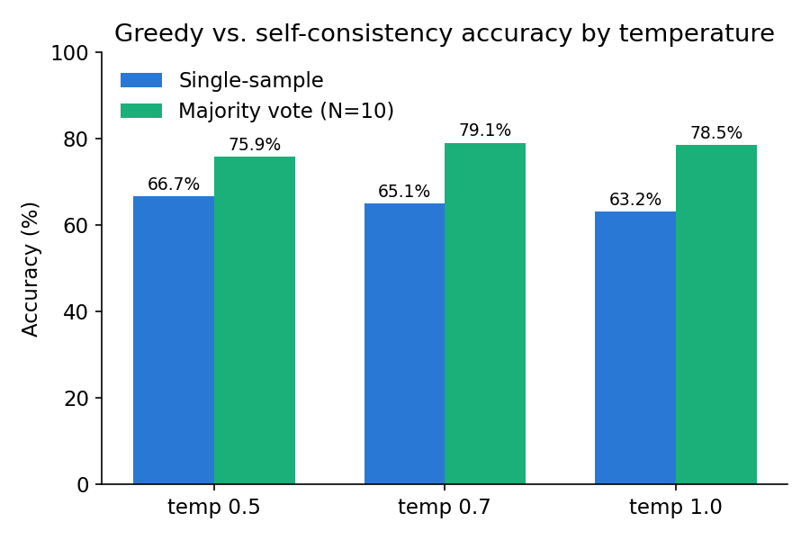
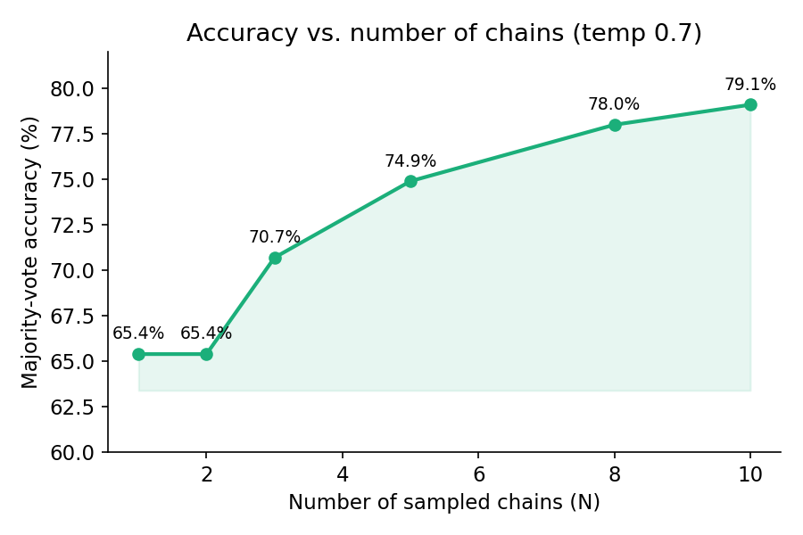
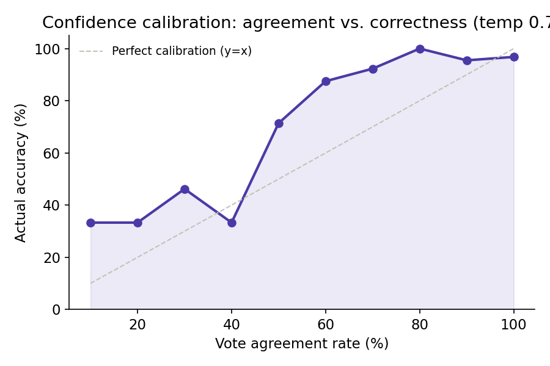

# Chain-of-thought self-consistency on GSM8K

A small inference-only study comparing greedy decoding against majority-vote
self-consistency on GSM8K math word problems, using Qwen2.5-1.5B-Instruct.
No fine-tuning — every result here comes from sampling the base instruct
model at different temperatures and voting across chains.

## Setup

- **Model:** Qwen2.5-1.5B-Instruct, float16, run on a single Colab T4
- **Dataset:** GSM8K test split, 191 questions (see [Limitations](#limitations)
  for why this isn't the full 200)
- **Prompting:** system-message instruction requiring the response to end
  with the exact phrase `The answer is X.`, no few-shot exemplars (an
  earlier few-shot version failed to reliably produce this format — see
  below)
- **Sampling:** temperatures 0.5 / 0.7 / 1.0, N=10 chains per question per
  temperature, `max_new_tokens=768`
- **Scoring:** answers extracted via regex on the fixed closing phrase;
  chains that never produce it are excluded from voting rather than guessed
  at

## Results

### Self-consistency beats greedy decoding at every temperature tested

| Temp | Single-sample accuracy | Majority-vote accuracy (N=10) | Lift |
|---|---|---|---|
| 0.5 | 66.7% | 75.9% | +9.2pp |
| 0.7 | 65.1% | 79.1% | +14.0pp |
| 1.0 | 63.2% | 78.5% | +15.3pp |

Temp 0.7 gives the best majority-vote accuracy outright. Temp 1.0 has the
weakest individual chains but gains the most from voting — more sample
diversity gives the correct answer more chances to become the mode, as long
as wrong chains don't all converge on the same wrong number.

### Most of the gain is captured well before N=10

| N | 1 | 2 | 3 | 5 | 8 | 10 |
|---|---|---|---|---|---|---|
| Accuracy | 65.4% | 65.4% | 70.7% | 74.9% | 78.0% | 79.1% |

At temp 0.7, roughly 70% of the total lift over greedy is already realized
by N=5. Diminishing returns are visible but the curve hasn't fully
flattened by N=10 — more chains would likely still help marginally.

### Vote agreement is a well-calibrated, label-free confidence signal

| Agreement | 10% | 20% | 30% | 40% | 50% | 60% | 70% | 80% | 90% | 100% |
|---|---|---|---|---|---|---|---|---|---|---|
| Accuracy | 33.3% | 33.3% | 46.2% | 33.3% | 71.4% | 87.5% | 92.3% | 100% | 95.5% | 96.8% |

This is the most useful result in the study: how often the sampled chains
agree with each other predicts how likely the majority answer is to be
correct, with no ground-truth labels required to compute it. The curve is
close to monotonic; the wobble in the 30–50% range (46.2% → 33.3% → 71.4%)
is small-sample noise, not a real reversal — those buckets each hold only
13–18 questions. A larger question set would smooth this out.

## Failure mode analysis

Three qualitatively distinct error types show up in the wrong answers, not
just one repeated mistake:

**1. Systematic misreading (high vote agreement, still wrong).**
*"Christina needs 0.75 gift bags per invited guest, because 1/4 of
attendees don't show up. She invited 16 friends..."* — all 10/10 chains
compute attendees (16 × 3/4 = 12), then multiply by 0.75 again, double
applying the no-show adjustment that's already baked into the 0.75 figure.
Predicted 18, correct answer 24. This is the case that most qualifies the
calibration result above: 10/10 agreement looks maximally trustworthy but
is confidently wrong, because every chain makes the same misreading rather
than independent random errors.

**2. Cascading confusion on multi-step "work backwards" problems (low vote
agreement).** A french-fry-counting problem requiring five sequential
reverse operations produced 10 different answers across 10 chains (20, 29,
42, 74, 31.5, 14, 57, 45, 48, 34) — the correct answer, 48, appears exactly
once. Low agreement here correctly signals genuine model confusion, unlike
case 1.

**3. Boundary-condition misinterpretation (correct arithmetic, wrong
stopping rule).** A break-even problem (tree costs $90, nets $7.50/year)
requires recognizing that $90 ÷ $7.50 = 12 years is exactly break-even, and
the question asks when profit turns *positive*, which needs a 13th year.
9/10 chains stop at 12. The arithmetic is right; the interpretation of
"starts earning money" vs. "breaks even" is wrong.

## Limitations

- **191 questions, not 200.** The generation run disconnected from the
  Colab runtime after completing 191 of 200 questions. The missing 9 are
  not included rather than backfilled with data from an earlier run that
  used a different `max_new_tokens` setting — mixing generation configs
  within one reported dataset would be a bigger problem than losing 4.5% of
  the sample.
- **`max_new_tokens` mattered more than expected.** Earlier runs at 256
  tokens showed a 12–13% rate of samples that never reached the required
  closing phrase; investigation showed ~88% of these were cut off
  mid-computation, not the model concluding in an unrecognized format.
  Raising the cap to 768 dropped the unparsed rate to 1.6%. This is a
  useful reminder that "parsing failure" and "generation truncation" can
  look identical from the output alone and are worth distinguishing before
  concluding a prompt or regex is broken.

- **No fine-tuning, single model, single dataset.** This is a scoped
  inference-time study, not a claim about self-consistency in general —
  results are specific to Qwen2.5-1.5B-Instruct on GSM8K.

